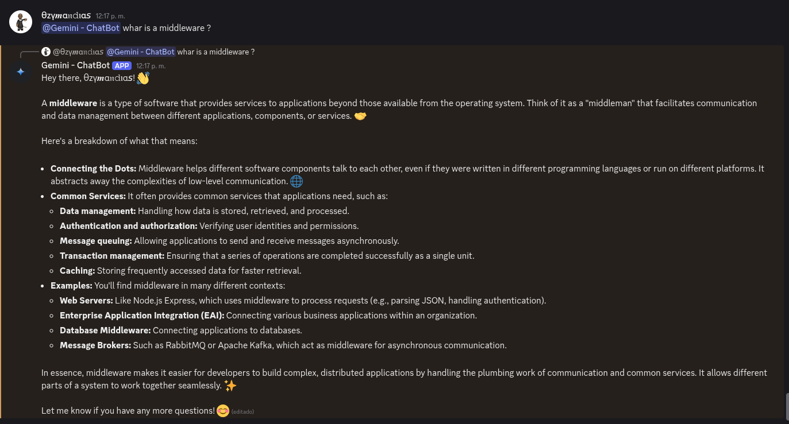
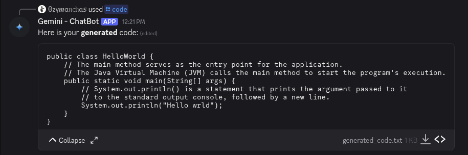
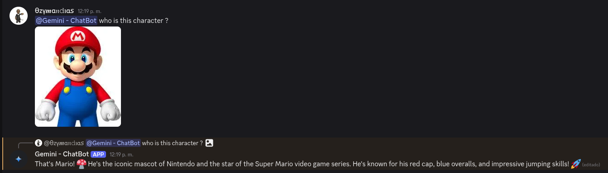

# Gemini ChatBot 🤖✨

[](https://opensource.org/licenses/MIT)
[](https://nodejs.org/)
[](https://www.typescriptlang.org/)

**Gemini ChatBot** is a powerful Discord bot powered by the **Gemini 2.5 API**. It enables natural language interaction through direct messages, mentions, and slash commands. Designed for performance and easy customization, this bot provides intelligent responses, helps with basic queries, and includes utility slash commands for specific tasks.

## 📌 Features

- 💬 **Natural Language Chat**: Responds to users via DM or mention using Google's Gemini API.
- 🧠 **Context-Aware**: Replies with a tone depending on the detected mood (neutral or humorous).
- 📖 **History Context**: The bot is capable of reading the chain of linked messages while maintaining the entire context of the conversation.
- 💻 **Slash Commands**: Offers various commands like `/help`, `/ping`, `/code`, and `/imagine` for guidance, performance checks, code generation, and image creation.
- ⚙️ **Configurable Behavior**: Uses system instructions to shape replies and stay within Discord's message limits.
- 🎬 **Multimodal**: You can interact with several types of data, not only text.

## 🔍 Usage Examples

Here are some examples of the bot in action:

### Text Response



### Code Generation



### Multimedia Interaction



## 📁 Project Structure

```
discord-gemini-chatbot/
│
├── src/
│   ├── commands/         # Slash commands like /help, /ping, /code, /imagine
│   ├── events/           # Discord event handlers (e.g. messageCreate, interactionCreate)
│   ├── lib/              # Shared utilities, types, and internal logic reused across the bot
│   └── index.ts          # Bot entry point
│
├── .env                  # Environment variables (tokens and API keys)
└── README.md             # Project documentation

```

## 🛠️ Requirements

- Node.js v18+
- Discord bot token
- Google Gemini API key (from [Google AI Studio](https://aistudio.google.com/app/apikey))

## 🔧 Environment Variables

Create a `.env` file based on `.env.example`:

```bash
cp .env.example .env
```

Then edit the `.env` file with your actual values:

```env
DISCORD_TOKEN=your-discord-token
CLIENT_ID=your-bot-id
GEMINI_API_KEY=your-gemini-api-key
```

### Getting Discord Credentials

1. Go to the [Discord Developer Portal](https://discord.com/developers/applications)
2. Create a new application
3. Go to the "Bot" section and create a bot
4. Copy the bot token (this is your `DISCORD_TOKEN`)
5. Go to "General Information" and copy the Application ID (this is your `CLIENT_ID`)
6. Invite the bot to your server with appropriate permissions

### Getting Gemini API Key

1. Visit [Google AI Studio](https://aistudio.google.com/app/apikey)
2. Create a new API key
3. Copy the API key (this is your `GEMINI_API_KEY`)

## 🚀 Running the Bot

```bash
npm install
npm run build
npm run start
```

Make sure your bot is invited with appropriate **Intents** and **Slash command scope**.

## ⚙️ Config file

There is a `config.json` file in the root directory, edit this file for specific behaviors, custom modifications or API usage. It provides easy access to bot functionality.

## 📚 Slash Commands

| Command    | Description                            |
| ---------- | -------------------------------------- |
| `/help`    | Shows basic usage information          |
| `/ping`    | Displays response and API latency      |
| `/code`    | Generate code based on your prompt     |
| `/imagine` | Generate an image based on your prompt |

## 💡 Usage Tips

- Mention the bot (`@Gemini`) or send it a DM to start chatting.
- Responses are limited to \~2000 characters per message, if the bot reach the limit, it will split the response in multiple messages.
- Use slash commands for specific functionalities.

## 🤝 Contributing

We welcome contributions! Please see our [Contributing Guide](CONTRIBUTING.md) for details.

### Quick Start for Contributors

1. Fork the repository
2. Create a feature branch: `git checkout -b feature/amazing-feature`
3. Make your changes
4. Run tests: `npm run lint` and `npm run build`
5. Commit your changes: `git commit -m 'Add amazing feature'`
6. Push to the branch: `git push origin feature/amazing-feature`
7. Open a Pull Request

## 🔒 Security

If you discover a security vulnerability, please see our [Security Policy](SECURITY.md) for reporting guidelines.

## 📄 License

This project is licensed under the MIT License - see the [LICENSE](LICENSE) file for details.

## 🆘 Support

- 📖 [Documentation](README.md)
- 🐛 [Issue Tracker](https://github.com/NamlessChokko/discord-gemini-chatbot/issues)
- 💬 [Discussions](https://github.com/NamlessChokko/discord-gemini-chatbot/discussions)

---

\_Created with 💻 by NamlessChokko
